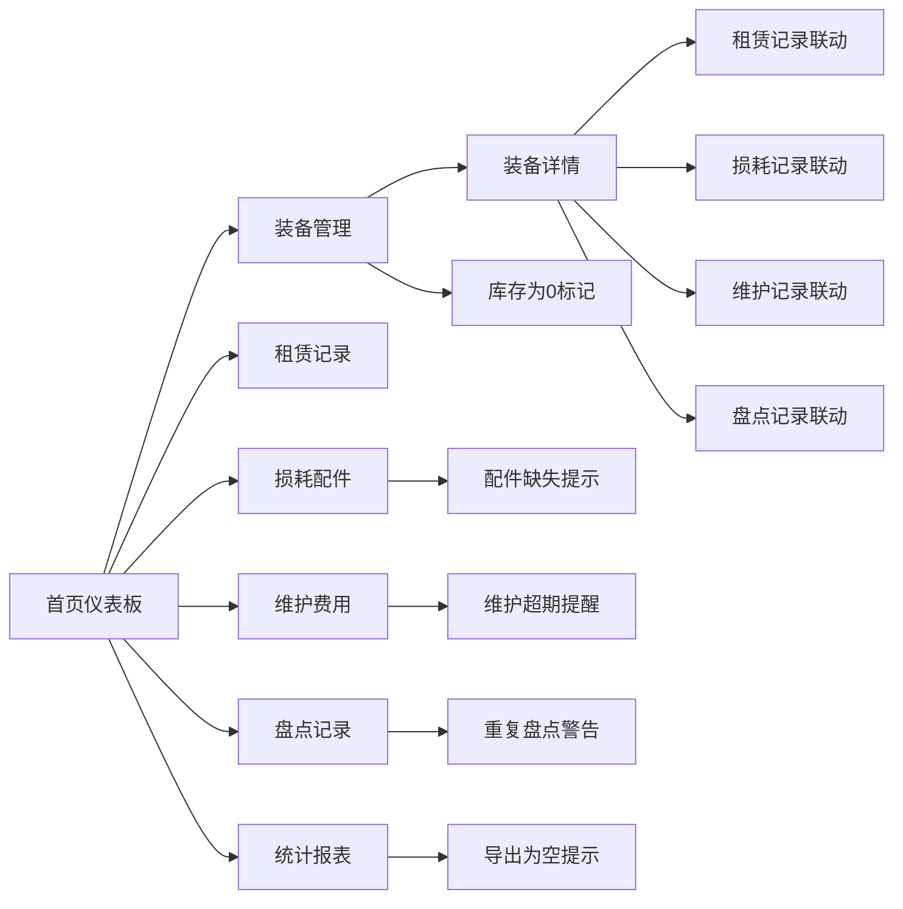

## 1. 产品概述

露营装备租赁台账管理系统，面向露营装备租赁门店管理者，提供装备全生命周期管理能力。系统覆盖基础信息、使用统计、损耗登记、费用核算、盘点记录、数据导出六大核心功能，通过本地模拟数据实现模块间数据互通与联动，帮助管理者高效管控装备状态、追踪使用成本、及时发现异常。

## 2. 核心功能

### 2.1 用户角色

| 角色 | 注册方式 | 核心权限 |
|------|----------|----------|
| 管理员 | 系统内置 | 装备管理、记录登记、盘点操作、数据导出、统计查看 |

### 2.2 功能模块

1. **基础信息管理**：装备列表展示、装备详情查看、装备分类筛选、库存状态显示
2. **外出使用次数统计**：租赁/外出记录管理、使用次数统计、使用时长追踪
3. **损耗配件登记**：配件缺失记录、损耗程度标注、补充状态追踪
4. **维护费用核算**：维护记录登记、费用分类统计、维护周期提醒
5. **收纳盘点记录**：盘点计划创建、盘点结果记录、异常状态标记
6. **数据统计导出**：多维度统计报表、CSV 格式导出、空数据提示

### 2.3 页面详情

| 页面名称 | 模块名称 | 功能描述 |
|----------|----------|----------|
| 首页仪表板 | 数据概览卡片 | 展示装备总数、在租数量、本月租赁次数、待维护数量等关键指标 |
| 首页仪表板 | 快捷操作区 | 快速进入各功能模块的入口卡片 |
| 装备管理 | 装备列表 | 支持搜索、分类筛选、状态筛选的装备表格展示 |
| 装备管理 | 装备详情 | 展示装备基本信息、使用记录、损耗记录、维护记录、盘点记录的联动详情 |
| 租赁记录 | 记录列表 | 展示所有租赁/外出记录，支持按装备、时间筛选 |
| 租赁记录 | 新增记录 | 登记新的租赁/外出使用记录 |
| 损耗配件 | 配件列表 | 展示所有损耗配件记录，支持按装备、状态筛选 |
| 损耗配件 | 损耗登记 | 登记新的配件损耗或缺失记录 |
| 维护费用 | 维护记录 | 展示所有维护记录，支持按装备、费用类型筛选 |
| 维护费用 | 费用登记 | 登记新的维护费用记录 |
| 盘点记录 | 盘点列表 | 展示所有盘点记录，支持按装备、时间筛选 |
| 盘点记录 | 新增盘点 | 创建新的盘点任务并记录盘点结果 |
| 统计报表 | 数据概览 | 多维度统计图表：使用次数排行、费用趋势、损耗分析 |
| 统计报表 | 数据导出 | 支持导出装备数据、租赁记录、费用明细等 CSV 文件 |

## 3. 核心流程

用户进入系统后，首先查看首页仪表板了解整体运营概况。通过左侧导航栏切换至各功能模块：

- 在装备管理中查看装备列表，点击单条装备可进入详情页，联动展示该装备的所有租赁、损耗、维护、盘点记录
- 在租赁记录中登记新的外出使用，系统自动更新装备的使用次数和状态
- 在损耗配件中登记配件缺失或损坏，系统在装备详情和仪表板中标记异常
- 在维护费用中登记维护记录，系统计算累计维护成本并对超期维护进行提醒
- 在盘点记录中创建盘点任务，重复盘点会给出警告提示
- 在统计报表中查看各类统计数据，支持导出 CSV 文件，导出数据为空时有明确提示

## 4. 用户界面设计

### 4.1 设计风格

- **设计理念**：户外工业风，融合露营自然元素与专业管理系统的严谨性
- **主色调**：森林绿 `#2D5A27` — 代表自然、稳重，契合露营主题
- **辅助色**：土橙色 `#D97706` — 代表活力、警示，用于强调和提示
- **中性色**：深灰 `#1F2937`、中灰 `#6B7280`、浅灰 `#F3F4F6`、米白 `#FAFAF7`
- **状态色**：成功绿 `#059669`、警告橙 `#D97706`、危险红 `#DC2626`、信息蓝 `#2563EB`
- **按钮风格**：圆角 6px，实心按钮带轻微阴影，悬停有颜色加深和上浮效果
- **字体**：标题使用 Noto Sans SC 加粗，正文使用 Noto Sans SC 常规
- **布局风格**：左侧固定导航栏 + 右侧内容区，卡片式布局，清晰的模块划分
- **图标风格**：使用 Lucide 线性图标，与整体简洁专业的风格一致

### 4.2 页面设计概述

| 页面名称 | 模块名称 | UI 元素 |
|----------|----------|---------|
| 首页仪表板 | 数据概览卡片 | 四色统计卡片，图标+数值+环比，卡片悬停微上浮 |
| 首页仪表板 | 快捷操作区 | 六大功能入口卡片，图标+标题+简介，渐变背景 |
| 装备管理 | 装备列表 | 顶部搜索筛选栏，表格展示，行悬停高亮，状态标签 |
| 装备管理 | 装备详情 | 左右布局，左侧基本信息，右侧标签页切换关联记录 |
| 租赁记录 | 记录列表 | 时间线样式展示记录，装备名称、时间、状态一目了然 |
| 损耗配件 | 配件列表 | 卡片网格布局，缺失配件红色边框高亮，补充状态标签 |
| 维护费用 | 维护记录 | 费用汇总卡片 + 记录列表，费用分类统计图表 |
| 盘点记录 | 盘点列表 | 盘点任务卡片，状态进度条，异常标记 |
| 统计报表 | 数据概览 | 多组图表卡片，柱状图、折线图、饼图组合 |
| 统计报表 | 数据导出 | 导出选项组，导出按钮，空状态友好提示 |

### 4.3 响应式

桌面端优先设计，支持平板端自适应。内容区采用弹性布局，表格和列表在小屏幕下可横向滚动。导航栏在平板端可折叠收起。

### 4.4 交互反馈

- **库存为 0**：装备列表中库存数量显示红色字体，搭配红色状态标签「缺货」
- **配件缺失**：装备卡片/列表项显示红色警示图标，悬停显示缺失配件详情
- **维护超期**：装备详情页显示橙色提醒条，列表中显示「待维护」标签
- **重复盘点**：提交盘点时弹框提示「该装备本月已盘点，是否继续？」，二次确认
- **导出为空**：导出按钮禁用并显示灰色 tooltip「暂无数据可导出」，或导出后提示「导出数据为空」
