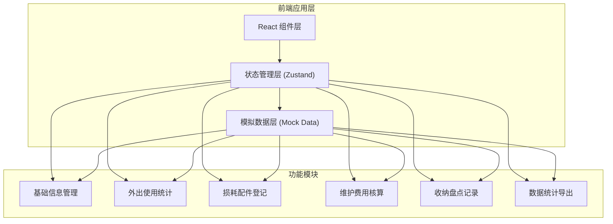
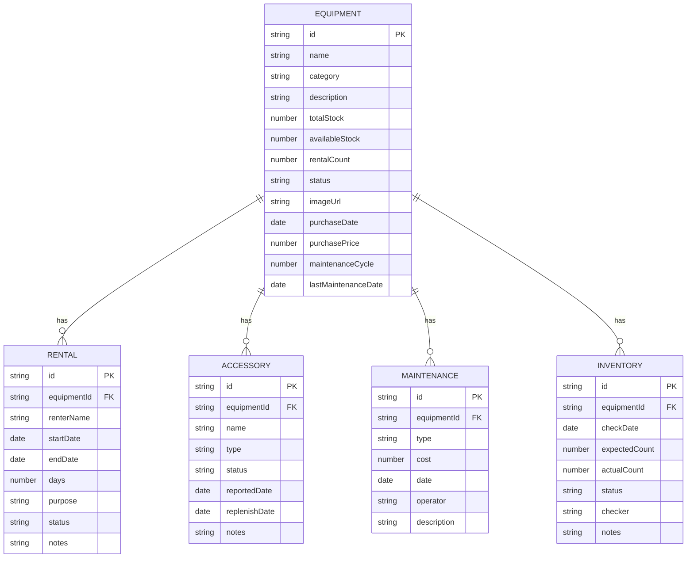

## 1. 架构设计



## 2. 技术描述

- **前端框架**：React@18 + TypeScript
- **构建工具**：Vite@5
- **样式方案**：TailwindCSS@3
- **状态管理**：Zustand
- **路由方案**：React Router DOM@6
- **图标库**：Lucide React
- **数据方案**：本地 Mock 数据，无后端服务
- **导出功能**：CSV 格式原生导出

## 3. 路由定义

| 路由 | 页面组件 | 功能描述 |
|------|----------|----------|
| `/` | Dashboard | 首页仪表板，数据概览与快捷入口 |
| `/equipment` | EquipmentList | 装备列表，基础信息管理 |
| `/equipment/:id` | EquipmentDetail | 装备详情，联动展示所有相关记录 |
| `/rentals` | RentalList | 租赁/外出使用记录列表 |
| `/accessories` | AccessoryList | 损耗配件登记列表 |
| `/maintenance` | MaintenanceList | 维护费用核算列表 |
| `/inventory` | InventoryList | 收纳盘点记录列表 |
| `/reports` | Reports | 统计报表与数据导出 |

## 4. 数据模型

### 4.1 数据模型 ER 图



### 4.2 数据类型定义

```typescript
// 装备信息
interface Equipment {
  id: string;
  name: string;
  category: string;
  description: string;
  totalStock: number;
  availableStock: number;
  rentalCount: number;
  status: 'normal' | 'maintenance' | 'damaged' | 'out_of_stock';
  imageUrl: string;
  purchaseDate: string;
  purchasePrice: number;
  maintenanceCycle: number;
  lastMaintenanceDate: string;
}

// 租赁记录
interface RentalRecord {
  id: string;
  equipmentId: string;
  renterName: string;
  startDate: string;
  endDate: string;
  days: number;
  purpose: string;
  status: 'active' | 'returned' | 'overdue';
  notes: string;
}

// 损耗配件
interface AccessoryRecord {
  id: string;
  equipmentId: string;
  name: string;
  type: 'missing' | 'damaged' | 'replaced';
  status: 'pending' | 'replenished';
  reportedDate: string;
  replenishDate?: string;
  notes: string;
}

// 维护记录
interface MaintenanceRecord {
  id: string;
  equipmentId: string;
  type: 'routine' | 'repair' | 'replacement';
  cost: number;
  date: string;
  operator: string;
  description: string;
}

// 盘点记录
interface InventoryRecord {
  id: string;
  equipmentId: string;
  checkDate: string;
  expectedCount: number;
  actualCount: number;
  status: 'normal' | 'abnormal' | 'missing';
  checker: string;
  notes: string;
}
```

## 5. 项目结构

```
src/
├── components/          # 通用组件
│   ├── Layout/         # 布局组件
│   ├── StatusBadge/    # 状态标签
│   ├── Modal/          # 弹窗组件
│   └── EmptyState/     # 空状态组件
├── pages/              # 页面组件
│   ├── Dashboard/
│   ├── Equipment/
│   ├── Rentals/
│   ├── Accessories/
│   ├── Maintenance/
│   ├── Inventory/
│   └── Reports/
├── store/              # Zustand 状态管理
│   └── useStore.ts
├── data/               # Mock 数据
│   └── mockData.ts
├── utils/              # 工具函数
│   ├── export.ts       # 导出相关
│   └── format.ts       # 格式化相关
├── types/              # TypeScript 类型定义
│   └── index.ts
├── App.tsx
├── main.tsx
└── index.css
```

## 6. 模块联动机制

1. **装备选择联动**：选择装备后，自动过滤展示该装备的租赁、损耗、维护、盘点记录
2. **库存联动**：租赁登记后自动扣减可用库存，归还后自动增加
3. **状态联动**：配件缺失/维护记录会自动更新装备状态标记
4. **统计联动**：所有数据变更后自动更新统计报表数据
5. **导出联动**：筛选条件变化后导出数据同步变化

## 7. 可见反馈设计

| 反馈场景 | 触发条件 | 表现形式 |
|----------|----------|----------|
| 配件缺失 | 装备存在未补充的缺失配件 | 列表红色警示图标 + 详情页红色提醒条 |
| 维护超期 | 当前日期 - 上次维护日期 > 维护周期 | 列表橙色「待维护」标签 + 详情页橙色提醒 |
| 库存为 0 | 可用库存 = 0 | 红色字体库存数 + 红色「缺货」状态标签 |
| 重复盘点 | 当月已有该装备的盘点记录 | 提交时弹框二次确认警告 |
| 导出为空 | 当前筛选条件下无数据 | 导出按钮禁用 + Tooltip 提示 |
